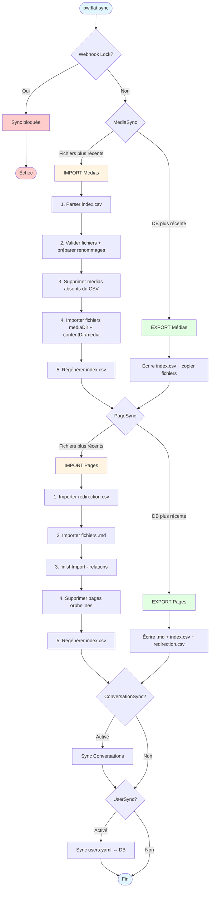

# Flat File CMS with Pushword

Transform Pushword in a FlatFile CMS.

## Documentation

Visit [pushword.piedweb.com](https://pushword.piedweb.com/extension/flat)

## Contributing

If you're interested in contributing to Pushword, please read our [contributing docs](https://pushword.piedweb.com/contribute) before submitting a pull request.

## Credits

- [PiedWeb](https://piedweb.com)
- [All Contributors](https://github.com/Pushword/Core/graphs/contributors)

## License

The MIT License (MIT). Please see [License File](https://pushword.piedweb.com/license#license) for more information.

---

# Schéma du flux `pw:flat:sync`

## Détails du processus

### Webhook Lock

Avant toute synchronisation, le système vérifie si un **webhook lock** est actif.
Ce verrou est utilisé pendant les workflows d'édition externe (ex: CI/CD) pour éviter les conflits.

### Décision Import/Export

`PageSync` et `MediaSync` déterminent indépendamment la direction :

- **MediaSync** : Compare le hash SHA1 des fichiers avec `Media->getHash()` en DB
- **PageSync** : Compare `filemtime()` avec `Page->getUpdatedAt()`, avec gestion des conflits via `ConflictResolver`

### Import Médias (Fichiers → DB)

1. **Parser `index.csv`** - Charge les métadonnées (id, fileName, name, alt, projectDir)
2. **Valider fichiers** - Vérifie l'existence des fichiers référencés
3. **Préparer renommages** - Détecte les fichiers renommés via leur ID
4. **Supprimer médias orphelins** - Supprime les médias en DB absents du CSV
5. **Importer fichiers** - Depuis `mediaDir` et `contentDir/media`
6. **Régénérer `index.csv`** - Reflète l'état final de la DB

### Import Pages (Fichiers → DB)

1. **Importer `redirection.csv`** - Charge les redirections
2. **Importer fichiers `.md`** - Parse le front matter YAML + contenu markdown
3. **finishImport** - Résout les relations (parentPage, mainImage, translations)
4. **Supprimer pages orphelines** - Pages en DB sans fichier `.md` ni entrée redirection
5. **Régénérer `index.csv`** - Avec les IDs auto-générés

### Export (DB → Fichiers)

**Pages** :
- Écrit `{slug}.md` avec front matter YAML
- Génère `index.csv` (métadonnées) et `redirection.csv`

**Médias** :
- Écrit `index.csv` avec les métadonnées
- Copie les fichiers si `copyMedia` est configuré

### UserSync (optionnel)

Synchronisation bidirectionnelle entre `config/users.yaml` et la DB :
- Exporte les utilisateurs DB manquants vers le YAML
- Importe/met à jour les utilisateurs depuis le YAML
- Les mots de passe restent uniquement en DB

### ConversationSync (optionnel)

Interface pour synchroniser les conversations (implémenté par le package conversation)
