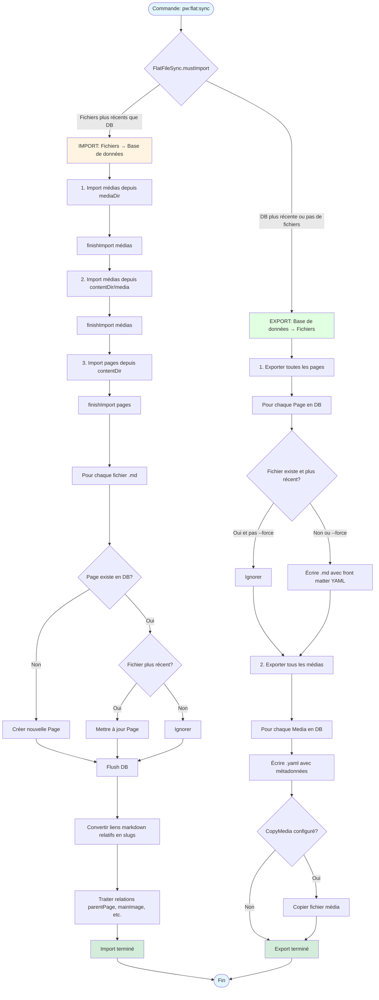

# Flat File CMS with Pushword

Transform Pushword in a FlatFile CMS.

## Documentation

Visit [pushword.piedweb.com](https://pushword.piedweb.com/extension/flat)

## Contributing

If you're interested in contributing to Pushword, please read our [contributing docs](https://pushword.piedweb.com/contribute) before submitting a pull request.

## Credits

- [PiedWeb](https://piedweb.com)
- [All Contributors](https://github.com/Pushword/Core/graphs/contributors)

## License

The MIT License (MIT). Please see [License File](https://pushword.piedweb.com/license#license) for more information.

---

# Schéma du flux `pw:flat:sync`

## Détails du processus

### Décision Import/Export

La méthode `FlatFileSync->mustImport()` détermine la direction :

- Scanne récursivement le répertoire de contenu
- Pour chaque fichier `.md`, compare `filemtime()` avec `Page->getUpdatedAt()`
- Si un fichier est plus récent que sa page en DB → **IMPORT**
- Sinon → **EXPORT**

### Import (Fichiers → DB)

1. **Import médias globaux** (`mediaDir`)
   - Parcourt récursivement le répertoire
   - Pour chaque fichier : vérifie si plus récent que `Media->getUpdatedAt()`
   - Met à jour ou crée l'entité `Media`
   - Lit les métadonnées depuis `.yaml` ou `.json` (deprecated) si présents

2. **Import médias locaux** (`contentDir/media`)
   - Même processus pour les médias spécifiques au contenu

3. **Import pages** (`contentDir`)
   - Parse chaque fichier `.md` avec front matter YAML
   - Extrait le slug (depuis front matter ou nom de fichier)
   - Met à jour ou crée l'entité `Page`
   - Convertit les liens markdown relatifs en slugs absolus
   - Traite les relations (parentPage, mainImage, translations, etc.)

### Export (DB → Fichiers)

1. **Export pages**
   - Pour chaque `Page` en DB :
     - Vérifie si le fichier `.md` existe et est plus récent (sauf avec `--force`)
     - Génère le front matter YAML avec toutes les propriétés
     - Écrit le fichier `{slug}.md`

2. **Export médias**
   - Pour chaque `Media` en DB :
     - Écrit un fichier `.yaml` avec les métadonnées
     - Si `copyMedia` est configuré, copie également le fichier média
