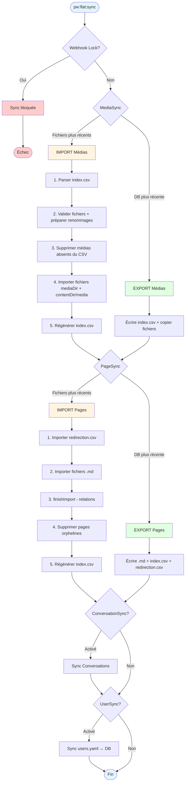

# Pushword Flat — Flat-File CMS

Turn Pushword into a **flat-file CMS** — pages and media stored as Markdown + CSV on disk, round-tripped with the database and trackable in **Git**.

[](https://github.com/Pushword/Pushword/tags)
[](LICENSE)
[](https://github.com/Pushword/Pushword/actions)

[](https://codecov.io/gh/Pushword/Pushword/tree/main)
[](https://shepherd.dev/github/pushword/pushword)
[](https://packagist.org/packages/pushword/core)

## Features

- Two-way **`pw:flat:sync`** between Markdown/CSV files and the database.
- **Auto-export** after admin edits, optional **auto git commit**.
- **Conflict resolution**, editorial locks and webhook locking.
- Optional **user sync** (`users.yaml`) and conversation sync.

## Installation

```shell
composer require pushword/flat
```

## Documentation

Visit [pushword.piedweb.com/extension/flat](https://pushword.piedweb.com/extension/flat).

## Sync flow (`pw:flat:sync`)


```mermaid
flowchart TD
    Start([pw:flat:sync]) --> LockCheck{Webhook Lock?}
    LockCheck -->|Oui| Blocked[Sync bloquée]
    LockCheck -->|Non| MediaCheck{MediaSync}

    MediaCheck -->|Fichiers plus récents| MediaImport[IMPORT Médias]
    MediaCheck -->|DB plus récente| MediaExport[EXPORT Médias]

    MediaImport --> MI1[1. Parser index.csv]
    MI1 --> MI2[2. Valider fichiers + préparer renommages]
    MI2 --> MI3[3. Supprimer médias absents du CSV]
    MI3 --> MI4[4. Importer fichiers mediaDir + contentDir/media]
    MI4 --> MI5[5. Régénérer index.csv]
    MI5 --> PageCheck

    MediaExport --> ME1[Écrire index.csv + copier fichiers]
    ME1 --> PageCheck

    PageCheck{PageSync} -->|Fichiers plus récents| PageImport[IMPORT Pages]
    PageCheck -->|DB plus récente| PageExport[EXPORT Pages]

    PageImport --> PI1[1. Importer redirection.csv]
    PI1 --> PI2[2. Importer fichiers .md]
    PI2 --> PI3[3. finishImport - relations]
    PI3 --> PI4[4. Supprimer pages orphelines]
    PI4 --> PI5[5. Régénérer index.csv]
    PI5 --> ConvCheck

    PageExport --> PE1[Écrire .md + index.csv + redirection.csv]
    PE1 --> ConvCheck

    ConvCheck{ConversationSync?} -->|Activé| ConvSync[Sync Conversations]
    ConvCheck -->|Non| UserCheck
    ConvSync --> UserCheck

    UserCheck{UserSync?} -->|Activé| UserSync[Sync users.yaml ↔ DB]
    UserCheck -->|Non| End
    UserSync --> End([Fin])

    Blocked --> EndBlocked([Échec])

    style Start fill:#e1f5ff
    style MediaImport fill:#fff4e1
    style PageImport fill:#fff4e1
    style MediaExport fill:#e1ffe1
    style PageExport fill:#e1ffe1
    style End fill:#e1f5ff
    style Blocked fill:#ffcccc
    style EndBlocked fill:#ffcccc
```

## Détails du processus

### Webhook Lock

Avant toute synchronisation, le système vérifie si un **webhook lock** est actif.
Ce verrou est utilisé pendant les workflows d'édition externe (ex: CI/CD) pour éviter les conflits.

### Décision Import/Export

`PageSync` et `MediaSync` déterminent indépendamment la direction :

- **MediaSync** : Compare le hash SHA1 des fichiers avec `Media->getHash()` en DB
- **PageSync** : Compare `filemtime()` avec `Page->getUpdatedAt()`, avec gestion des conflits via `ConflictResolver`

### Import Médias (Fichiers → DB)

1. **Parser `index.csv`** - Charge les métadonnées (id, fileName, name, alt, projectDir)
2. **Valider fichiers** - Vérifie l'existence des fichiers référencés
3. **Préparer renommages** - Détecte les fichiers renommés via leur ID
4. **Supprimer médias orphelins** - Supprime les médias en DB absents du CSV
5. **Importer fichiers** - Depuis `mediaDir` et `contentDir/media`
6. **Régénérer `index.csv`** - Reflète l'état final de la DB

### Import Pages (Fichiers → DB)

1. **Importer `redirection.csv`** - Charge les redirections
2. **Importer fichiers `.md`** - Parse le front matter YAML + contenu markdown
3. **finishImport** - Résout les relations (parentPage, mainImage, translations)
4. **Supprimer pages orphelines** - Pages en DB sans fichier `.md` ni entrée redirection
5. **Régénérer `index.csv`** - Avec les IDs auto-générés

### Export (DB → Fichiers)

**Pages** :
- Écrit `{slug}.md` avec front matter YAML
- Génère `index.csv` (métadonnées) et `redirection.csv`

**Médias** :
- Écrit `index.csv` avec les métadonnées
- Copie les fichiers si `copyMedia` est configuré

### UserSync (optionnel)

Synchronisation bidirectionnelle entre `config/users.yaml` et la DB :
- Exporte les utilisateurs DB manquants vers le YAML
- Importe/met à jour les utilisateurs depuis le YAML
- Les mots de passe restent uniquement en DB

### ConversationSync (optionnel)

Interface pour synchroniser les conversations (implémenté par le package conversation)

## The Pushword ecosystem

Pushword is a modular CMS — one [Symfony](https://symfony.com) bundle for the core and one bundle per feature. Pick only what you need:

**Core**
- [pushword/core](https://github.com/Pushword/core) — Symfony-based CMS core: Page, Media & User entities, Markdown + Twig rendering.

**Editing & admin**
- [pushword/admin](https://github.com/Pushword/admin) — EasyAdmin interface to manage pages, media and users.
- [pushword/admin-block-editor](https://github.com/Pushword/admin-block-editor) — Gutenberg-like block editor (stores Markdown).
- [pushword/advanced-main-image](https://github.com/Pushword/advanced-main-image) — Hero images & main-image format control.
- [pushword/template-editor](https://github.com/Pushword/template-editor) — Edit Twig templates online.
- [pushword/snippet](https://github.com/Pushword/snippet) — Reusable content fragments & components.

**Content & workflow**
- **pushword/flat** — Flat-file (Markdown + Git) CMS mode. *(this package)*
- [pushword/version](https://github.com/Pushword/version) — Page & snippet versioning.
- [pushword/page-update-notifier](https://github.com/Pushword/page-update-notifier) — Email alerts on content changes.
- [pushword/conversation](https://github.com/Pushword/conversation) — Comments, contact & newsletter forms.

**Publishing & performance**
- [pushword/static-generator](https://github.com/Pushword/static-generator) — Export a static website (GitHub Pages, Apache, FrankenPHP).
- [pushword/search](https://github.com/Pushword/search) — SQLite full-text search (Loupe), zero infra.
- [pushword/page-scanner](https://github.com/Pushword/page-scanner) — Find dead links, 404s, redirects & TODOs.
- [pushword/api](https://github.com/Pushword/api) — Token-authenticated REST API.

**Tooling**
- [pushword/installer](https://github.com/Pushword/installer) — Project & package installer.
- [pushword/js-helper](https://github.com/Pushword/js-helper) — Front-end JavaScript helpers.

Full list and guides on [pushword.piedweb.com/extensions](https://pushword.piedweb.com/extensions).

## Contributing

If you're interested in contributing to Pushword, please read our [contributing docs](https://pushword.piedweb.com/contribute) before submitting a pull request.

## Credits

- [PiedWeb](https://piedweb.com)
- [All Contributors](https://github.com/Pushword/Core/graphs/contributors)

## License

The MIT License (MIT). Please see [License File](https://pushword.piedweb.com/license#license) for more information.

<p align="center"><a href="https://dev.piedweb.com">

</a></p>
