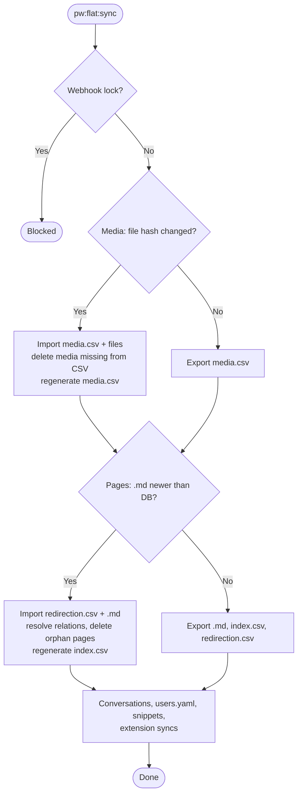

# Pushword Flat — Flat-File CMS

Turn Pushword into a **flat-file CMS** — pages and media stored as Markdown + CSV on disk, round-tripped with the database and trackable in **Git**.

[](https://github.com/Pushword/Pushword/tags)
[](LICENSE)
[](https://github.com/Pushword/Pushword/actions)

[](https://github.com/Pushword/Pushword/actions/workflows/run-tests.yml)
[](https://shepherd.dev/github/pushword/pushword)
[](https://packagist.org/packages/pushword/core)

## Features

- Two-way **`pw:flat:sync`** between Markdown/CSV files and the database.
- **Auto-export** after admin edits, optional **auto git commit**.
- **Conflict resolution**, editorial locks and webhook locking.
- Optional **user sync** (`users.yaml`), conversation and snippet sync.

## Installation

```shell
composer require pushword/flat
```

## Documentation

Visit [pushword.piedweb.com/extension/flat](https://pushword.piedweb.com/extension/flat).

## Sync flow (`pw:flat:sync`)

Each entity decides its own direction: import when files are newer, export when the
database is. Details: [sync behavior reference](https://pushword.piedweb.com/extension/flat#sync-behavior-reference).


```mermaid
flowchart TD
    Start([pw:flat:sync]) --> LockCheck{Webhook lock?}
    LockCheck -->|Yes| Blocked([Blocked])
    LockCheck -->|No| Media{Media: file hash changed?}

    Media -->|Yes| MediaImport[Import media.csv + files<br/>delete media missing from CSV<br/>regenerate media.csv]
    Media -->|No| MediaExport[Export media.csv]
    MediaImport --> Page
    MediaExport --> Page

    Page{Pages: .md newer than DB?} -->|Yes| PageImport[Import redirection.csv + .md<br/>resolve relations, delete orphan pages<br/>regenerate index.csv]
    Page -->|No| PageExport[Export .md, index.csv, redirection.csv]
    PageImport --> Others
    PageExport --> Others

    Others[Conversations, users.yaml, snippets,<br/>extension syncs] --> End([Done])
```

## The Pushword ecosystem

Pushword is a modular CMS — one [Symfony](https://symfony.com) bundle for the core and one bundle per feature. Pick only what you need:

**Core**
- [pushword/core](https://github.com/Pushword/core) — Symfony-based CMS core: Page, Media & User entities, Markdown + Twig rendering.

**Editing & admin**
- [pushword/admin](https://github.com/Pushword/admin) — EasyAdmin interface to manage pages, media and users.
- [pushword/admin-block-editor](https://github.com/Pushword/admin-block-editor) — Gutenberg-like block editor (stores Markdown).
- [pushword/advanced-main-image](https://github.com/Pushword/advanced-main-image) — Hero images & main-image format control.
- [pushword/template-editor](https://github.com/Pushword/template-editor) — Edit Twig templates online.
- [pushword/snippet](https://github.com/Pushword/snippet) — Reusable content fragments & components.

**Content & workflow**
- **pushword/flat** — Flat-file (Markdown + Git) CMS mode. *(this package)*
- [pushword/version](https://github.com/Pushword/version) — Page & snippet versioning.
- [pushword/page-update-notifier](https://github.com/Pushword/page-update-notifier) — Email alerts on content changes.
- [pushword/conversation](https://github.com/Pushword/conversation) — Comments, contact & newsletter forms.

**Publishing & performance**
- [pushword/static-generator](https://github.com/Pushword/static-generator) — Export a static website (GitHub Pages, Apache, FrankenPHP).
- [pushword/search](https://github.com/Pushword/search) — SQLite full-text search (Loupe), zero infra.
- [pushword/page-scanner](https://github.com/Pushword/page-scanner) — Find dead links, 404s, redirects & TODOs.
- [pushword/api](https://github.com/Pushword/api) — Token-authenticated REST API.

**Tooling**
- [pushword/installer](https://github.com/Pushword/installer) — Project & package installer.
- [pushword/js-helper](https://github.com/Pushword/js-helper) — Front-end JavaScript helpers.

Full list and guides on [pushword.piedweb.com/extensions](https://pushword.piedweb.com/extensions).

## Contributing

If you're interested in contributing to Pushword, please read our [contributing docs](https://pushword.piedweb.com/contribute) before submitting a pull request.

## Credits

- [PiedWeb](https://piedweb.com)
- [All Contributors](https://github.com/Pushword/Pushword/graphs/contributors)

## License

The MIT License (MIT). Please see [License File](https://pushword.piedweb.com/license#license) for more information.

<p align="center"><a href="https://dev.piedweb.com">

</a></p>
